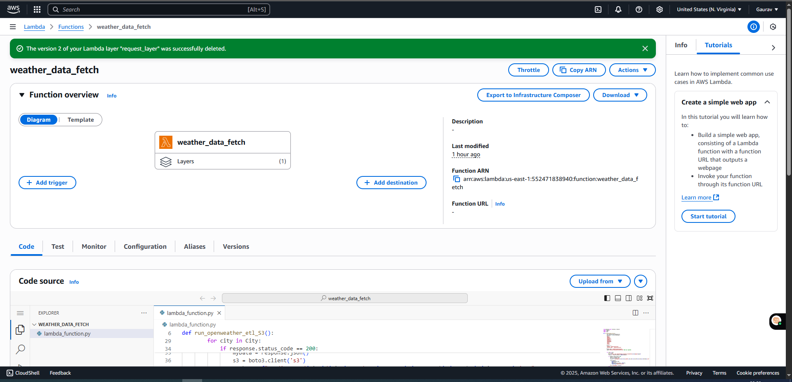
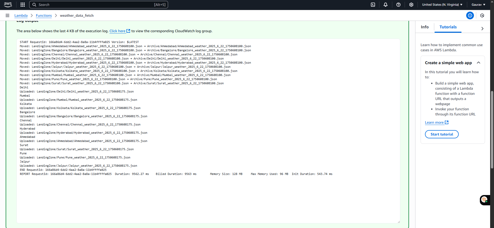

# Weather-DataPipeline-Using-AWS-LAMBDA

## Layer
```
mkdir requests_layer
pip install requests -t requests_layer/

cd requests_layer/

##IMP STEP
zip the Python folder only using 7zip as requests_layer.zip

## Because the folder structure AWS expect is below
requests_layer.zip
└── python/
    └── requests/
    └── certifi/

```
## Output 


