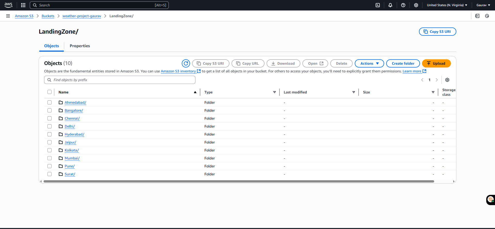
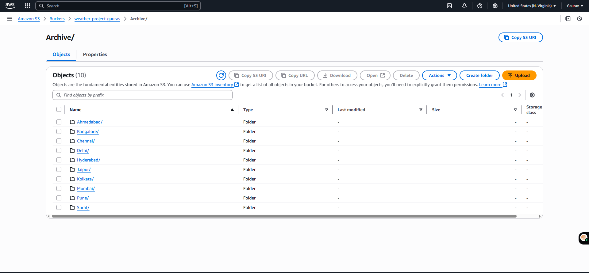

# Weather-DataPipeline-Using-AWS-LAMBDA

## Layer
```
mkdir requests_layer
pip install requests -t requests_layer/

cd requests_layer/

##IMP STEP
zip the Python folder only using 7zip as requests_layer.zip

## Because the folder structure AWS expect is below
requests_layer.zip
└── python/
    └── requests/
    └── certifi/

```
## Output 


### S3 bucket Output



## Common Errors
- Lambda role does not have the valid permission to communicate within services like S3 bucker or any other services. Make sure you provide the valid policies to the lambda role only.
- Timeout issue: So this issue occurs as by default values is being set as 3 sec. So go the configuration in the lambda function -> general -> increase the timeout to preferrable time eg: 1 min 30 sec
